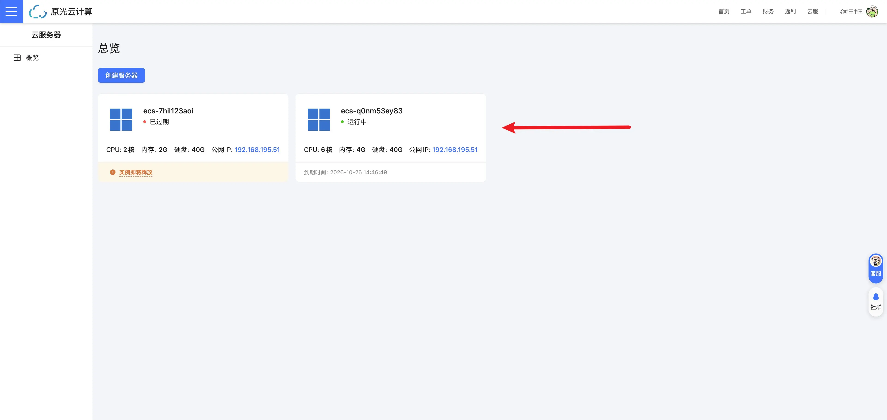

import { Tabs, TabItem } from "@astrojs/starlight/components";
import { Steps } from "@astrojs/starlight/components";

购买 ECS 实例后，您需要通过远程连接来访问和管理服务器。本文将指导您如何在不同操作系统上使用 SSH 连接到您的云服务器。

## 连接前的准备

在开始连接之前，请确保您已经：

- 获取了服务器的 **IP 地址**
- 获取了 **SSH 登录的端口号**（Linux）或是 **远程桌面端口号**（Windows）
- 获取了 **用户名**（通常是 `root` `administrator` 或其他指定用户）
- 获取了 **密码** 或 **SSH 密钥**

## 连接步骤

请点击下列标签，查看服务器不同操作系统的连接方法：

<Tabs>
<TabItem label="Windows 系列操作系统" icon="seti:windows">
:::tip[选择远程桌面的工具]
Windows 操作系统自带远程桌面连接（Remote Desktop Protocol，RDP）可直接忽略本内容

MacOS 操作系统可直接在 App Store (非中国大陆区商店) 下载 Windows APP 工具，[点我跳转](https://apps.apple.com/us/app/windows-app/id1295203466?mt=12)
也可以 前往 [原光云技术云盘](https://pan.opticalvm.com) 检索 rdp 下载 macos 版本
:::

### 使用 Windows 远程桌面连接 (RDP)

原光云提供了一键连接按钮，点击即可下载远程桌面连接文件（.rdp），双击打开后输入密码即可连接。

<Steps>

1. 服务器安装完毕后，点击卡片进入服务器详情页面

   

2. ok

</Steps>

</TabItem>
<TabItem label="Linux 系列操作系统" icon="linux">

</TabItem>
</Tabs>
