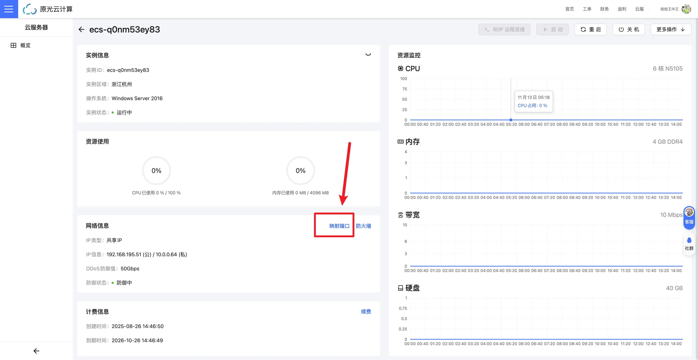
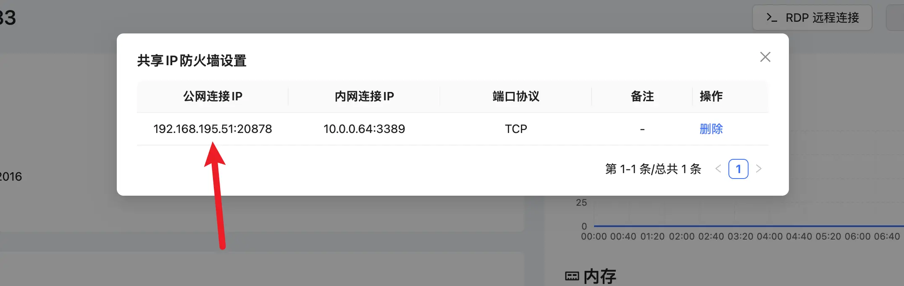
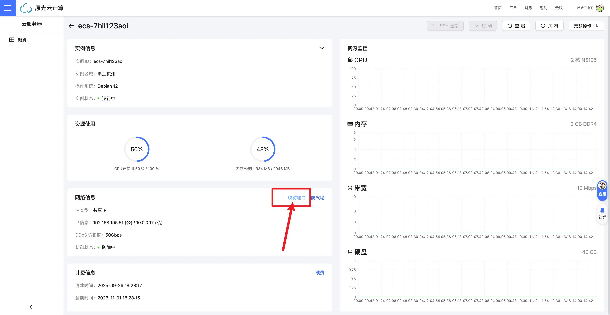
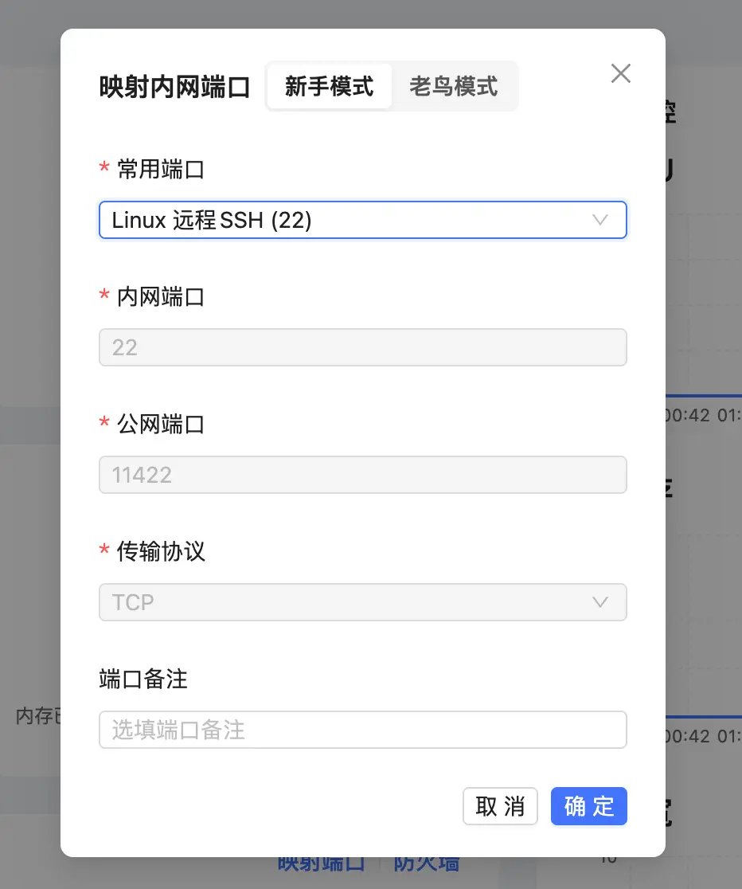
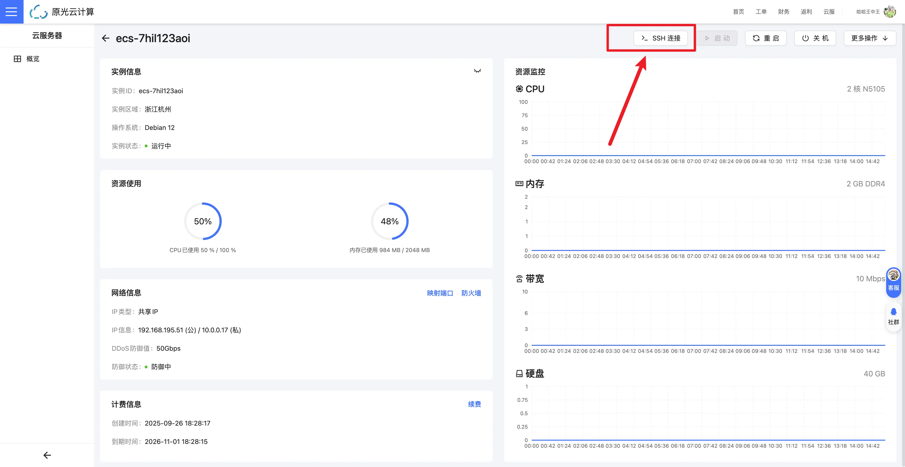
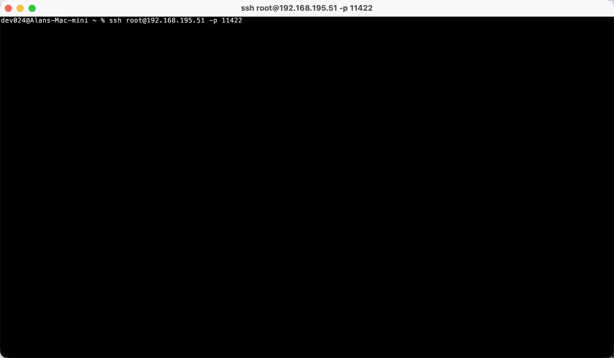
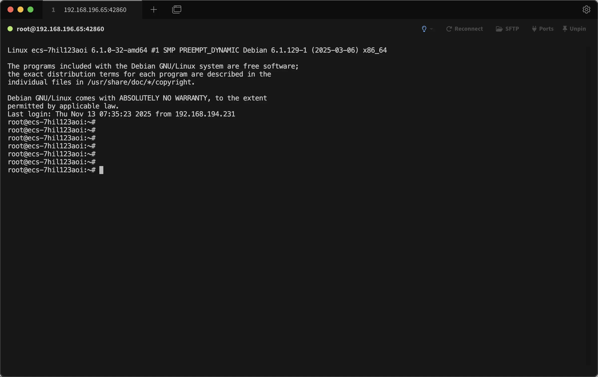
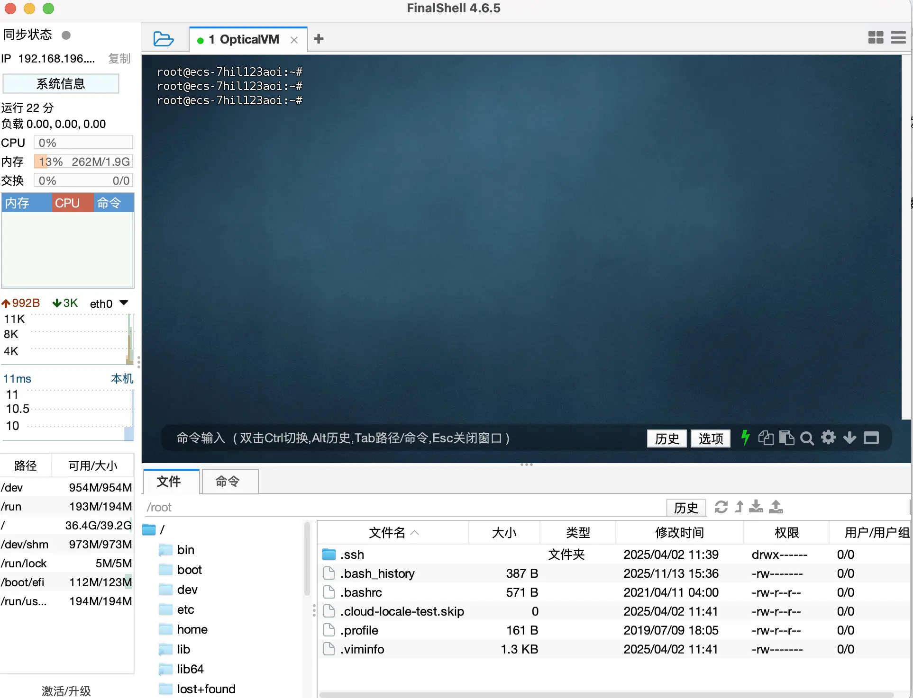

import { Tabs, TabItem } from "@astrojs/starlight/components";
import { Steps } from "@astrojs/starlight/components";

购买 ECS 实例后，您需要通过远程连接来访问和管理服务器。本文将指导您如何在不同操作系统上使用 SSH 连接到您的云服务器。

## 连接前的准备

在开始连接之前，请确保您已经：

- 获取了服务器的 **IP 地址**
- 获取了 **SSH 登录的端口号**（Linux）或是 **远程桌面端口号**（Windows）
- 获取了 **用户名**（通常是 `root` `administrator` 或其他指定用户）
- 获取了 **密码** 或 **SSH 密钥**

## 连接步骤

请点击下列标签，查看服务器不同操作系统的连接方法：

<Tabs>
<TabItem label="Windows 系列操作系统" icon="seti:windows">
:::tip[选择远程桌面的工具]
Windows 操作系统自带远程桌面连接（Remote Desktop Protocol，RDP）可直接忽略本内容

MacOS 操作系统可直接在 App Store (非中国大陆区商店) 下载 Windows APP 工具，<a href="https://apps.apple.com/us/app/windows-app/id1295203466?mt=12" target="_blank">点我跳转</a>
也可以 前往 <a href="https://pan.opticalvm.com" target="_blank">原光云技术云盘</a> 检索 rdp 下载 macos 版本
:::

### 使用 Windows 远程桌面连接 (RDP)

原光云提供了一键连接按钮，点击即可下载远程桌面连接文件（.rdp），双击打开后输入密码即可连接。

<Steps>

1. 服务器安装完毕后，点击卡片进入服务器详情页面

   

2. 默认情况下云服务器 RDP 远程连接按钮是灰色的，这是因为没有开放对应的端口号。
   找到下方的 **网络信息** 区域，点击 **映射端口** 进入设置模态框

   

3. 在弹出的模态框中，选择 **Windows 远程桌面 (3389)** ，然后点击 **确认** 映射端口

   

4. 端口映射成功后，RDP 远程连接按钮会变为蓝色，点击该按钮即可下载远程桌面连接文件（.rdp）。双击打开该文件，输入 **服务器** 密码，即可连接到您的 Windows 服务器。

   

   :::tip[手动配置]
   当然，如果使用手动的方式配置远程桌面请参考下面的教程
   :::

   点击 **防火墙** 按钮，复制内网 `3389` 端口对应的公网连接 IP 地址

   

   打开远程桌面连接程序，在计算机一栏输入复制的 IP 地址，用户名如没有特殊设置那么默认是 `administrator`，点击连接后输入云服务器密码即可成功连接到服务器

   :::tip[特别注意]
   注意，这里的用户名不能是本地计算机自带的用户。您可以点击其它用户手动输入用户名 `administrator` 进行连接。或直接使用上方介绍的远程桌面连接文件（.rdp）进行连接。
   :::

   

</Steps>

</TabItem>
<TabItem label="Linux 系列操作系统" icon="linux">

### 使用 SSH 连接 Linux 服务器

<Steps>

1. 服务器安装完毕后，点击卡片进入服务器详情页面

   

2. 默认情况下云服务器 SSH 远程连接按钮是灰色的，这是因为没有开放对应的端口号。
   找到下方的 **网络信息** 区域，点击 **映射端口** 进入设置模态框

   

3. 在弹出的模态框中，选择 **Linux 远程 SSH (22)** ，然后点击 **确认** 映射端口

   

</Steps>

:::tip[选择 SSH 工具]
选择适合自己的，下方会介绍几种热门的 SSH 工具连接方式。
:::

<Tabs>
  <TabItem label="系统自带Termial">
  <Steps>

1. 点击控制台右上角的 **SSH 远程连接** 按钮，弹出连接信息模态框，复制下方的连接命令

   

2. 粘贴到您的终端（Terminal）中，按回车执行该命令。

   

3. 输入服务器密码（默认不显示），按回车即可成功连接到服务器。

  </Steps>

  </TabItem>
  <TabItem label="Tabby">
    <Steps>

1. 点击 Tabby 的 **新建连接** 按钮，选择 **SSH** 连接类型。或直接点击新建窗口，教程以后者为主。

   

2. 从原光云控制台点击防火墙按钮，复制内网 `22` 端口对应的公网连接 IP 地址

   

3. 粘贴进 Tabby 的输入框中，并同意 host key，点击连接按钮。

   

4. 连接成功

   

</Steps>
  
  </TabItem>
  <TabItem label="Xshell">
      <Steps>

1. 从原光云控制台点击防火墙按钮，复制内网 `22` 端口对应的公网连接 IP 地址

   

2. 点击 Xshell 的 **新建连接** 按钮，选择 **SSH** 连接类型。名称可以随意填写。主机填写刚才复制的 IP 地址，端口填写 `:` 号后面显示的数字 ，协议选择 `SSH`，点击确定保存。

   

3. 连接成功

   

</Steps>
  </TabItem>
</Tabs>

</TabItem>
</Tabs>
