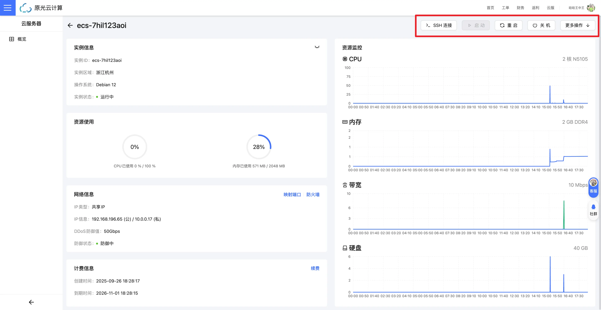

ECS 实例的电源管理是日常运维中最基础的操作。通过开机、关机、重启功能，您可以控制实例的运行状态，实现以下场景：

- **开机**：启动已关闭的实例，恢复业务运行
- **关机**：停止实例运行，节省资源或进行维护
- **重启**：快速重启实例，应用配置变更或解决临时故障

:::tip[温馨提示]
这些操作将影响实例的运行状态和业务可用性，请在操作前确认业务影响，避免在高峰期进行非必要操作。
:::

## 操作入口

操作按钮均可以在 ECS 实例列表页或实例详情页中找到：

### 开机

指物理意义上的开机，用于将处于关闭状态的 ECS 实例启动起来。

### 关机

:::danger[注意]
在现行版本中，关机操作将会执行 **强制关机** 操作。类似于物理意义上的断电。
:::
指物理意义上的关机，用于将正在运行的 ECS 实例关闭。

### 重启

:::danger[注意]
在现行版本中，重启操作将会执行 **强制关机** 操作，并将实例启动。
:::
指物理意义上的重启，用于将正在运行的 ECS 实例重新启动一次。
