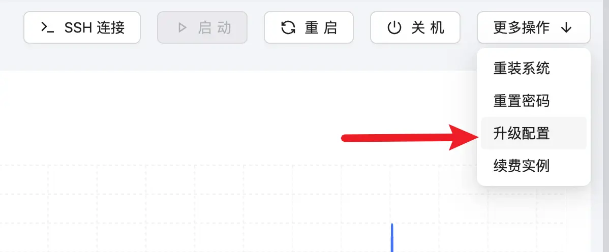

ECS 实例的升降配置操作，允许用户根据业务需求动态调整实例的规格配置，实现资源的灵活管理。通过升降配置，您可以：

### 升级配置

点击云服务器详情中的“升级配置”按钮，选择更高规格的实例类型，提升计算、内存或存储资源，以满足业务增长需求。



#### 升级费用计算规则

升级配置采用**按量补差**的计费方式，仅对配置增量部分按剩余时间收费。

**核心公式：**

```txt
升级费用 = (增量配置月价格 ÷ 30天) × 实例剩余天数
```

**详细计算步骤：**

1. **计算增量配置月价格**

   ```
   增量月价格 = Σ(各配置项增量 × 对应单价)
              = (新CPU - 旧CPU) × CPU单价
              + (新内存 - 旧内存) × 内存单价
              + (新存储 - 旧存储) × 存储单价
              + (新带宽 - 旧带宽) × 带宽单价
   ```

2. **转换为日价格**

   ```
   增量日价格 = 增量月价格 ÷ 30
   ```

3. **计算剩余天数**

   ```
   剩余天数 = (实例到期时间 - 当前时间) ÷ 24小时
   ```

4. **计算最终费用**
   ```
   升级费用 = 增量日价格 × 剩余天数
   ```

**计算示例：**

假设您的实例当前状态如下：

- **当前配置**：2 核 CPU、4GB 内存、50GB 存储、10Mbps 带宽
- **价格标准**：CPU ¥30/核/月、内存 ¥15/GB/月、存储 ¥1/GB/月、带宽 ¥20/Mbps/月
- **实例剩余天数**：15 天

您计划将配置升级为：**4 核 CPU、8GB 内存、100GB 存储、20Mbps 带宽**

**计算过程：**

```
步骤1：计算各配置项增量月价格
  CPU 增量：(4 - 2) × ¥30 = ¥60/月
  内存增量：(8 - 4) × ¥15 = ¥60/月
  存储增量：(100 - 50) × ¥1 = ¥50/月
  带宽增量：(20 - 10) × ¥20 = ¥200/月

  增量月价格合计 = ¥60 + ¥60 + ¥50 + ¥200 = ¥370/月

步骤2：转换为日价格
  增量日价格 = ¥370 ÷ 30 = ¥12.33/天

步骤3：计算最终升级费用
  升级费用 = ¥12.33/天 × 15天 = ¥185.00
```

**最终支付：¥185.00**

:::tip[温馨提示]

- 升级配置后，实例的到期时间 **保持不变**
- 费用仅按 **配置增量 × 剩余时间** 收取，不会浪费已购时长

  :::

### 降级配置

:::danger[重要说明]
因考虑到资源调度和服务稳定性，当前版本不支持直接降级实例配置。

如果您需要降低实例配置，建议采用以下方案：

- **新建实例**：购买更低配置的新实例，迁移数据后释放旧实例

  :::
